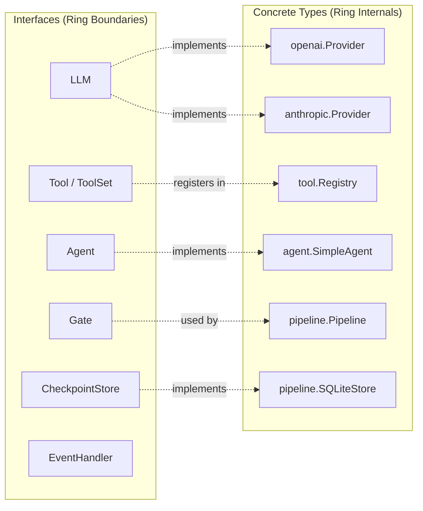
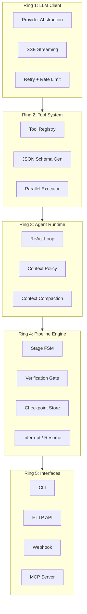
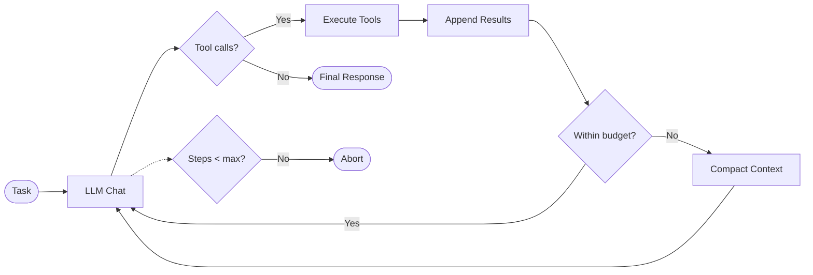
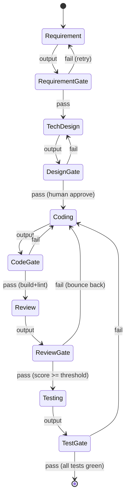
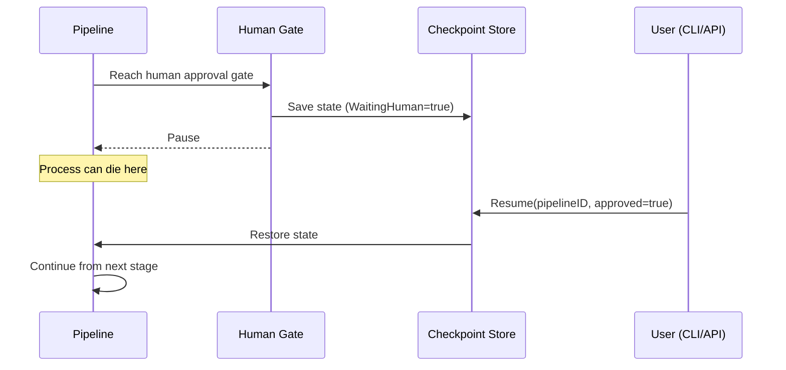

# GoForge Architecture

## Overview

GoForge is an AI-powered development workflow engine built from scratch in Go. It orchestrates multi-stage pipelines (requirement → design → code → review → test) where each stage is powered by an LLM-based Agent with stage-specific context and verification gates.

## Design Philosophy

1. **Inside-out dependency**: Inner rings never import outer rings
2. **Simplicity over abstraction**: Hand-written loops over graph engines
3. **Compile-time safety**: Go generics enforce type correctness at build time
4. **Active context management**: Strategy-driven context loading, not passive accumulation
5. **Verification-first**: Every stage transition requires explicit validation

## Interface Design Principles

Derived from analyzing Eino (ByteDance), tRPC-Agent-Go (Tencent), and ADK-Go (Google):

**Rule: Ring boundaries use interfaces; ring internals use concrete types.**

- **Interfaces at boundaries** — where implementations are swappable (LLM providers, checkpoint backends, tools). Keep interfaces narrow: 1-3 methods. If an interface grows beyond 3 methods, split it.
- **Concrete types for orchestration** — the ReAct loop, Pipeline FSM, and Registry are concrete structs. Debuggability matters more than abstraction for these core paths.
- **Function types for lightweight strategies** — `CompactFunc`, `GateFunc`, `ContextSource` are function signatures, not interfaces. Avoids single-method interface boilerplate.
- **Optional capabilities via type assertion** — e.g., if a `Tool` also implements `StreamableTool`, detect at runtime. Don't force all tools to implement streaming.
- **No cross-provider dependencies** — providers within the same ring must not import each other. Shared utilities go to `internal/`.



---

## Concentric Ring Model



Cross-cutting concerns (`internal/`): config, logging (zap), telemetry (OTel).

---

## Ring 1: LLM Client

**Learning goals**: Provider pattern, SDK integration, `iter.Seq2`, type conversion at boundaries

### Core Interface

```go
type LLM interface {
    Chat(ctx context.Context, messages []Message, opts ...Option) (*Response, error)
    ChatStream(ctx context.Context, messages []Message, opts ...Option) iter.Seq2[Chunk, error]
}
```

### Message Types

Provider-agnostic types — no dependency on any vendor's data model:

```go
type Role string

const (
    RoleSystem    Role = "system"
    RoleUser      Role = "user"
    RoleAssistant Role = "assistant"
    RoleTool      Role = "tool"
)

type Message struct {
    Role       Role
    Content    string
    ToolCalls  []ToolCall
    ToolCallID string
}

type ToolCall struct {
    ID       string
    Name     string
    Args     string // raw JSON
}

type Response struct {
    Message    Message
    Usage      Usage
    StopReason StopReason
}

type Chunk struct {
    Delta      string
    ToolCall   *ToolCall
    Usage      *Usage
    StopReason StopReason
}
```

### Design Decisions

| Decision | Rationale |
|----------|-----------|
| Custom Message types, not vendor-specific | ADK-Go binds to `genai.Content` — changing providers means rewriting everything. We convert at the boundary. |
| `iter.Seq2[Chunk, error]` for streaming | Go 1.23 range-over-func — caller uses `for chunk, err := range stream { }`. No callback hell. |
| Functional options (`...Option`) | Extensible without breaking: `WithTemperature(0.7)`, `WithMaxTokens(4096)`, `WithStopSequences(...)` |
| Provider does bidirectional conversion | Each provider implements `toProviderMessages()` and `fromProviderResponse()`. Core types stay clean. |

### Providers

Thin adapter pattern — each provider wraps an official SDK and only does bidirectional type conversion.

- **OpenAI-compatible**: `openai/openai-go` SDK. Works with OpenAI, DeepSeek, Ollama, any OpenAI-API-compatible service
- **Anthropic**: `anthropics/anthropic-sdk-go` SDK. Claude Messages API with tool_use block mapping

See [M1_DESIGN_NOTES.md](M1_DESIGN_NOTES.md) for detailed code-level comparison with reference frameworks.

### Retry & Rate Limiting

```go
type RetryConfig struct {
    MaxRetries     int
    InitialBackoff time.Duration
    MaxBackoff     time.Duration
    RetryableHTTP  []int // e.g., 429, 500, 502, 503
}
```

Exponential backoff with jitter. Rate limit info parsed from response headers (`x-ratelimit-*`).

---

## Ring 2: Tool System

**Learning goals**: Reflection, generics, JSON Schema generation, struct tags

### Core Interface

```go
type Tool interface {
    Name() string
    Description() string
    Schema() *jsonschema.Schema
    Execute(ctx context.Context, args json.RawMessage) (string, error)
}
```

### Generic Tool Constructor

Automatically generates JSON Schema from Go struct tags:

```go
func NewTool[Args any](name, desc string, fn func(context.Context, Args) (string, error)) Tool
```

Usage:

```go
type CalcArgs struct {
    A float64 `json:"a" jsonschema:"description=First number"`
    B float64 `json:"b" jsonschema:"description=Second number"`
    Op string `json:"op" jsonschema:"enum=add,enum=multiply"`
}

calcTool := tool.NewTool("calculator", "Basic arithmetic", func(ctx context.Context, args CalcArgs) (string, error) {
    switch args.Op {
    case "add":
        return fmt.Sprintf("%f", args.A+args.B), nil
    case "multiply":
        return fmt.Sprintf("%f", args.A*args.B), nil
    }
    return "", fmt.Errorf("unknown op: %s", args.Op)
})
```

### Tool Registry

```go
type Registry struct {
    mu    sync.RWMutex
    tools map[string]Tool
}

func (r *Registry) Register(tools ...Tool) error
func (r *Registry) Get(name string) (Tool, bool)
func (r *Registry) Schemas() []jsonschema.Schema
```

Concurrent-safe. `Schemas()` returns all tool schemas in the format needed for LLM function calling.

### Parallel Execution

When the LLM returns multiple `tool_calls`, execute concurrently:

```go
func ExecuteParallel(ctx context.Context, registry *Registry, calls []ToolCall) []ToolResult {
    g, ctx := errgroup.WithContext(ctx)
    results := make([]ToolResult, len(calls))
    for i, call := range calls {
        g.Go(func() error {
            result, err := registry.Execute(ctx, call)
            results[i] = ToolResult{CallID: call.ID, Content: result, Err: err}
            return nil // don't short-circuit others
        })
    }
    g.Wait()
    return results
}
```

### Design Decisions

| Decision | Rationale |
|----------|-----------|
| JSON Schema from struct tags | Eino's `goStruct2ParamsOneOf` approach — no manual schema writing. |
| `json.RawMessage` for args | Defer deserialization to the generic wrapper. Tool interface stays simple. |
| goroutine + errgroup | ADK-Go pattern: parallel tool execution. One tool failure doesn't cancel others. |

---

## Ring 3: Agent Runtime

**Learning goals**: ReAct pattern, context window management, iterators

### Core Interface

```go
type Agent interface {
    Run(ctx context.Context, task string) iter.Seq2[Event, error]
}
```

### Event Types

```go
type EventType int

const (
    EventThink      EventType = iota // LLM reasoning text
    EventToolCall                     // Tool invocation
    EventToolResult                   // Tool output
    EventResponse                     // Final answer
    EventError                        // Error occurred
)

type Event struct {
    Type       EventType
    Content    string
    ToolCall   *ToolCall
    ToolResult *ToolResult
    Usage      *Usage
}
```

### ReAct Loop (Hand-written, ~200 lines)



Pseudocode:

```
messages = [system_prompt, user_task]
for step in 0..max_steps:
    response = llm.Chat(ctx, messages, tools=registry.Schemas())
    yield ThinkEvent(response)
    if no tool_calls:
        yield ResponseEvent(response)
        return
    results = ExecuteParallel(registry, response.ToolCalls)
    yield ToolCallEvent, ToolResultEvent for each
    messages = append(messages, response, results...)
    if token_count(messages) > policy.MaxTokens:
        messages = compact(messages, policy)
```

### Context Policy (Core Innovation #1)

Each pipeline stage configures a distinct context strategy:

```go
type ContextPolicy struct {
    MaxTokens       int
    Sources         []ContextSource
    Breadth         Breadth   // Wide | Narrow
    Depth           Depth     // Shallow | Deep
    CompactStrategy CompactFunc
}

type Breadth int
const (
    BreadthWide   Breadth = iota
    BreadthNarrow
    BreadthMedium
)

type Depth int
const (
    DepthShallow Depth = iota
    DepthDeep
    DepthMedium
)
```

Stage-specific policies:

```
Stage "requirement"  → ContextPolicy{Breadth: Wide,  Depth: Shallow, Sources: [api_docs, service_topology]}
Stage "coding"       → ContextPolicy{Breadth: Narrow, Depth: Deep,    Sources: [target_files, direct_deps]}
Stage "review"       → ContextPolicy{Breadth: Medium, Depth: Medium,  Sources: [git_diff, impact_analysis]}
```

### Three-Tier Compaction

Inspired by Claude Code's compaction strategy:

1. **Budget compaction**: Drop oldest tool results (cheapest)
2. **Micro compaction**: Truncate long tool outputs to summaries
3. **Full compaction**: LLM-based conversation summarization (most expensive)

```go
func DefaultCompact(ctx context.Context, llm LLM, messages []Message, budget int) ([]Message, error) {
    current := tokenCount(messages)
    if current <= budget { return messages, nil }

    // Tier 1: drop old tool results
    messages = dropOldToolResults(messages, budget)
    if tokenCount(messages) <= budget { return messages, nil }

    // Tier 2: truncate long outputs
    messages = truncateLongContent(messages, 500)
    if tokenCount(messages) <= budget { return messages, nil }

    // Tier 3: LLM summarization
    return summarizeConversation(ctx, llm, messages, budget)
}
```

---

## Ring 4: Pipeline Engine

**Learning goals**: FSM, serialization (gob), persistence (SQLite), human-in-the-loop

### Core Types (Core Innovation #2 & #3)

```go
type Stage[In, Out any] struct {
    Name     string
    Run      func(ctx context.Context, input In, agent *Agent) (Out, error)
    Verify   func(ctx context.Context, output Out) error  // verification gate
    Policy   ContextPolicy
}

type GateType int
const (
    GateAuto       GateType = iota // automated check (build, lint, test)
    GateLLMReview                  // LLM evaluates output quality
    GateHuman                      // human approval required (interrupt)
)
```

### Pipeline Architecture



### FSM Implementation (~300 lines)

Why FSM over Graph:
- Dev-workflow is **linear pipeline + conditional retry**, not arbitrary DAG
- No need for Pregel/BSP complexity (Eino uses 2000+ lines for its graph engine)
- Verification gates are naturally modeled as FSM transitions

```go
type PipelineState struct {
    CurrentStage  string
    StageIndex    int
    Status        PipelineStatus  // Running | Paused | Completed | Failed
    RetryCount    map[string]int
    Data          map[string]any  // stage outputs keyed by stage name
    WaitingHuman  bool
}

type PipelineStatus int
const (
    StatusRunning   PipelineStatus = iota
    StatusPaused    // waiting for human approval
    StatusCompleted
    StatusFailed
)
```

### Checkpoint Store

SQLite-backed persistence with gob serialization:

```go
type CheckpointStore interface {
    Save(ctx context.Context, pipelineID string, state *PipelineState) error
    Load(ctx context.Context, pipelineID string) (*PipelineState, error)
    List(ctx context.Context) ([]PipelineInfo, error)
}
```

Pipeline survives process restarts. On resume, loads checkpoint → restores to last completed gate → continues.

### Interrupt / Resume



### Audit Log

Every state transition is logged:

```go
type AuditEntry struct {
    Timestamp  time.Time
    PipelineID string
    Stage      string
    Action     string   // "enter", "gate_pass", "gate_fail", "retry", "interrupt", "resume"
    Detail     string
}
```

---

## Ring 5: Interfaces

**Learning goals**: `net/http` stdlib, CLI design, webhook handling, MCP protocol

### HTTP API

Standard library only (`net/http`), no framework:

| Method | Path | Description |
|--------|------|-------------|
| POST | `/api/v1/pipelines` | Trigger new pipeline |
| GET | `/api/v1/pipelines/:id` | Get pipeline status |
| POST | `/api/v1/pipelines/:id/resume` | Resume paused pipeline |
| GET | `/api/v1/pipelines/:id/events` | SSE event stream |
| GET | `/health` | Health check |

### CLI

```
goforge chat                   # Interactive chat with agent
goforge run <requirement>      # Trigger full pipeline
goforge status <pipeline-id>   # Check pipeline status
goforge resume <pipeline-id>   # Approve and resume
goforge tools list             # List registered tools
```

### MCP Server

Expose GoForge as an MCP tool server — enables integration with Cursor, Claude Desktop:

- `goforge_trigger_pipeline`: Start a workflow
- `goforge_pipeline_status`: Query status
- `goforge_resume_pipeline`: Approve and resume

---

## Cross-Cutting: internal/

### Config

```go
type Config struct {
    LLM      LLMConfig
    Pipeline PipelineConfig
    Log      LogConfig
    Server   ServerConfig
}
```

Environment variables + YAML file. No viper — simple `os.Getenv` + `yaml.Unmarshal`.

### Logging

`zap` structured logger. Every package receives logger via dependency injection (not global).

### Telemetry

OpenTelemetry integration:
- **Traces**: Span per pipeline stage, span per agent step, span per tool call
- **Metrics**: Token usage, latency per stage, retry counts, gate pass/fail rates

---

## Directory Structure

```
goforge/
├── cmd/
│   ├── goforge/main.go          # CLI entry
│   └── server/main.go           # HTTP server entry
├── pkg/
│   ├── llm/                     # Ring 1
│   │   ├── llm.go               # LLM interface
│   │   ├── message.go           # Provider-agnostic message types
│   │   ├── option.go            # Functional options
│   │   ├── openai/              # OpenAI SDK adapter
│   │   │   └── provider.go
│   │   └── anthropic/           # Anthropic SDK adapter
│   │       └── provider.go
│   ├── tool/                    # Ring 2
│   │   ├── tool.go              # Tool interface
│   │   ├── registry.go          # Tool registry
│   │   ├── schema.go            # JSON Schema generation
│   │   └── builtin/             # Built-in tools
│   │       ├── file.go
│   │       ├── shell.go
│   │       └── calc.go
│   ├── agent/                   # Ring 3
│   │   ├── agent.go             # Agent interface + ReAct loop
│   │   ├── context.go           # ContextPolicy + compaction
│   │   └── event.go             # Event types
│   ├── pipeline/                # Ring 4
│   │   ├── pipeline.go          # Pipeline + Stage[In,Out]
│   │   ├── gate.go              # Verification gates
│   │   ├── checkpoint.go        # SQLite checkpoint store
│   │   └── state.go             # PipelineState FSM
│   ├── workflow/                # Dev workflow stages
│   │   ├── requirement.go
│   │   ├── techdesign.go
│   │   ├── coding.go
│   │   ├── review.go
│   │   └── testing.go
│   └── server/                  # Ring 5: HTTP API
│       ├── handler.go
│       └── webhook.go
├── internal/
│   ├── config/
│   ├── log/
│   └── telemetry/
├── docs/
│   └── ARCHITECTURE.md          # This file
├── AGENTS.md
├── feature_list.json
├── progress.md
├── session-handoff.md
├── init.sh
├── go.mod
└── README.md
```

---

## Comparison with Reference Frameworks

| Dimension | Eino (ByteDance) | tRPC-Agent-Go (Tencent) | ADK-Go (Google) | **GoForge** |
|-----------|------------------|------------------------|-----------------|-------------|
| ReAct | Graph-compiled (550 LOC) | Processor pipeline | Hand-written loop | **Hand-written loop** (~200 LOC) |
| Orchestration | compose.Graph (Pregel) | graph.StateGraph (BSP/DAG) | Workflow agents | **FSM + Gate** (~300 LOC) |
| State | Graph state + checkpoint | Session event sourcing | Session + StateDelta | **Typed PipelineState** |
| Context | Middleware compaction | Summary service | ContentsProcessor | **ContextPolicy per stage** |
| Generics | Extensive (Graph[I,O]) | Minimal (map[string]any) | None (genai fixed) | **Stage[In,Out] compile-safe** |
| Multi-agent | AgentTool / Flow | Team / Transfer | SubAgent tree | **Orchestrator-Worker goroutine** |
| Dependencies | CloudWeGo ecosystem | tRPC ecosystem | Gemini/genai | **Zero framework** |

---

## Learning Path

| Milestone | Goal | AI Skills | Go Skills | ~LOC |
|-----------|------|-----------|-----------|------|
| M1: Hello LLM | Chat + stream | LLM API, prompting | SDK integration, iter.Seq2 | 500 |
| M2: Tool Calling | Typed tools | Function calling, JSON Schema | Reflection, generics, struct tags | 800 |
| M3: ReAct Agent | Think-act-observe | ReAct pattern, step limits | goroutine, errgroup | 400 |
| M4: Context Engineering | Smart compaction | Token counting, context window | String processing, LRU | 600 |
| M5: Pipeline Engine | Multi-stage + checkpoint | FSM, persistence, interrupt | SQLite, gob, state machines | 800 |
| M6: Dev Workflow | Full workflow | Orchestrator-Worker, Evaluator | Comprehensive | 1500 |
| M7: Production Ready | API + CLI + observability | MCP, webhooks | net/http, OTel, zap | 1000 |

**Total**: ~5,600 lines core + ~3,000 lines tests = ~8,600 lines
